# 🏛️ Architecture Nexus OS

## Vue d'ensemble

**Nexus OS** est l'écosystème d'orchestration centralisée de tous les produits IA de TrouveUnCadeau.xyz.

```mermaid
graph TB
    subgraph "Nexus OS - Orchestration Centrale"
        NEXUS[nexus-api<br/>Orchestrateur]
        CONTROL[control-center<br/>Dashboard Admin]
    end

    subgraph "Produits Front-End"
        TUC_FRONT[trouveuncadeau.xyz<br/>Frontend Principal]
        ALERT_FRONT[alerterabais-frontend<br/>Interface Deals]
        MONIA_FRONT[moniaamoi<br/>Frontend Personnel]
    end

    subgraph "Moteurs Backend"
        TUC_BACK[trouveuncadeau.xyz-opus<br/>Moteur IA Cadeaux]
        ALERT_BACK[alerterabais<br/>Moteur Scraping]
        MAC[monacheteurai<br/>Moteur Affiliation]
    end

    subgraph "Services Externes"
        SUPABASE[(Supabase<br/>Base de données)]
        SENDGRID[SendGrid<br/>Emails]
        AMAZON[Amazon API<br/>Affiliation]
        RENDER[Render<br/>Déploiement]
    end

    %% Flux Frontend vers Backend
    TUC_FRONT -->|Recherche IA| TUC_BACK
    ALERT_FRONT -->|Alertes Prix| ALERT_BACK
    MONIA_FRONT -->|Dashboard| MAC

    %% Orchestration Nexus
    NEXUS ---|Coordonne| TUC_BACK
    NEXUS ---|Coordonne| ALERT_BACK
    NEXUS ---|Coordonne| MAC
    CONTROL ---|Monitore| NEXUS

    %% Services externes
    TUC_BACK --> SUPABASE
    ALERT_BACK --> SUPABASE
    ALERT_BACK --> SENDGRID
    MAC --> AMAZON
    
    %% Déploiement
    TUC_FRONT -.-> RENDER
    ALERT_FRONT -.-> RENDER
    TUC_BACK -.-> RENDER
    ALERT_BACK -.-> RENDER

    style NEXUS fill:#4a90e2,stroke:#2e5c8a,color:#fff
    style CONTROL fill:#7b68ee,stroke:#4b3a9e,color:#fff
    style ALERT_FRONT fill:#50c878,stroke:#2d7a4a,color:#fff
```

---

## 📍 Ce Repo: **alerterabais-frontend**

### Rôle
Interface utilisateur web pour afficher les deals et rabais canadiens.

### Stack
- **Frontend**: HTML5, CSS3, JavaScript vanilla
- **Déploiement**: Render (static site)
- **Données**: mock-products-canada.json (100 produits)

### Intégrations
- **Backend**: [alerterabais](https://github.com/trouveuncadeauxyz-cell/alerterabais) (API Scraping)
- **API**: `https://affiliationengine-api-cjv8.onrender.com`
- **Affiliation**: Amazon Associate Tag `trouveuncadea-20`

### Fichiers Clés
- `index.html` - Page principale
- `assets/js/` - Scripts frontend
- `assets/data/mock-products-canada.json` - Données de test

---

## 🔗 Repos Nexus OS

### Orchestration
- [nexus-api](https://github.com/trouveuncadeauxyz-cell/nexus-api) - API centrale
- [control-center](https://github.com/trouveuncadeauxyz-cell/control-center) - Dashboard admin

### Produits
- [trouveuncadeau.xyz-opus](https://github.com/trouveuncadeauxyz-cell/trouveuncadeau.xyz-opus) - Moteur IA cadeaux
- [alerterabais](https://github.com/trouveuncadeauxyz-cell/alerterabais) - Backend scraping
- [alerterabais-frontend](https://github.com/trouveuncadeauxyz-cell/alerterabais-frontend) - **(CE REPO)**
- [monacheteurai](https://github.com/trouveuncadeauxyz-cell/monacheteurai) - Moteur affiliation
- [moniaamoi](https://github.com/trouveuncadeauxyz-cell/moniaamoi) - Dashboard personnel

---

## 🛠️ Technologies

| Composant | Stack |
|-----------|-------|
| **Frontend** | HTML5, CSS3, JavaScript |
| **Backend API** | Python 3.11, FastAPI |
| **Base de données** | Supabase (PostgreSQL) |
| **Orchestration** | LangChain, LangGraph |
| **Déploiement** | Render.com |
| **Emails** | SendGrid |
| **Affiliation** | Amazon Product API |

---

## 📚 Documentation

- [README.md](../README.md) - Guide principal
- [docs/CONTEXT.md](../docs/CONTEXT.md) - Contexte technique
- [docs/API.md](../docs/API.md) - Intégration API
- [CHANGELOG.md](../CHANGELOG.md) - Historique des versions

---

*Nexus OS © 2026 - TrouveUnCadeau.xyz*
